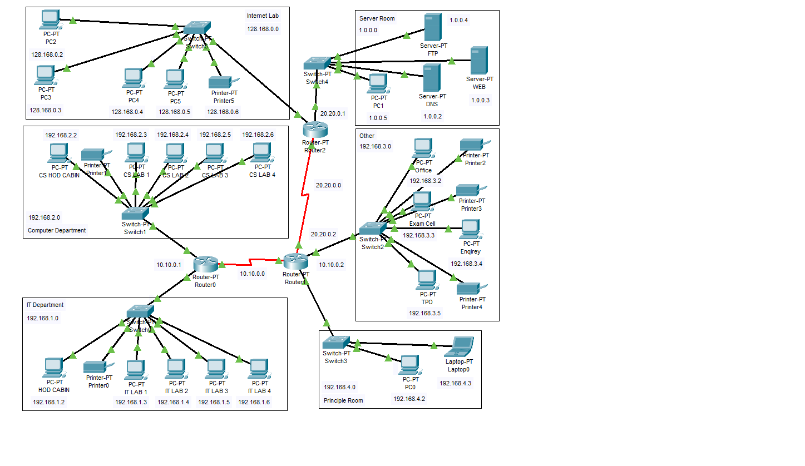

## College-network-arctitectures  
# Installation Instructions
- **Download Cisco Packet Tracer:** Visit the official Cisco Networking Academy website to download Cisco Packet Tracer. You may need to create an account or log in to access the download link.

- **Install Cisco Packet Tracer:** Follow the installation instructions provided with the downloaded file. Cisco Packet Tracer is available for various operating systems including Windows, macOS, and Linux.

- **Open the Project File:** Download the simple campus network project file and open it in Cisco Packet Tracer. You can find the project file attached to this repository.

- **Explore the Network:** Once the project is opened, you can explore the Simple campus network. Familiarize yourself with the layout and components of each network.

# Objectives

The main objective of the proposed network is to update the existing network and also enhance its
capabilities and increase the flexibility of the network which will eventually provide good security

## Network Requirements

1: The new system should be able to reduce internet downtime. Download and upload links should be maintained above 5 Mbps speed requirement.

2: Network will be scalable.

3: The system should support remote access.

4: Should comprise of data centers with necessary security features and support.

## Existing Infrastructure

The existing system is a very basic system. College mainly comprises of three main sections as
1. TPO & Other
2. Exam Center
3. Office
All the hosts are assigned with static IPs and are assigned in the order in which it where set up.
No support for dynamic IP allocations. Even though the working is divided into three major sectors all the
host, multimedia devices are connected in a single network. Thus, network security and maintenance are
difficult. One more problem observed was the existing switches were outdated and hence could not prove to
be beneficial for the network administrator to observe monitor and handle the network traffic the system has
no remote access to the network. Absence of basic small-scale businesses firewall was also observed. Thus,
security is also compromised. Three server rooms were used for the purpose of independent networking
which further caused wastage of power and money.

## Routing Protocol Plan

Pull requests are welcome. For major changes, please open an issue first
to discuss what you would like to change.

Please make sure to update tests as appropriate.

## Summary

The outcome of the proposed system will be a fail-safe backbone network infrastructure which meets
the requirements for readily available access to information and security of the private network, and
also ensures optimized productivity when telecommunication services are accessed. The installed
equipment allowed to organize high-speed wired and wireless Internet access throughout the whole
complex of hospital buildings as well as providing transfer of all types of data throughout the single
optimized network.

## License

[MIT](https://choosealicense.com/licenses/mit/)
